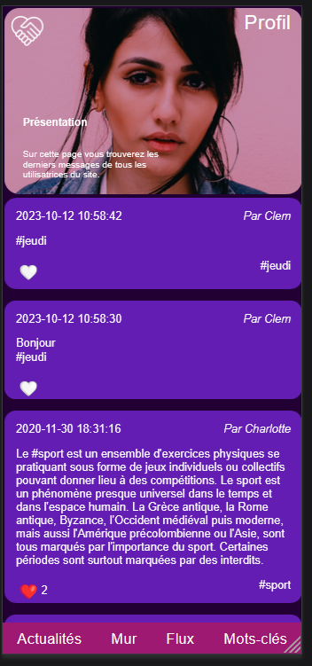
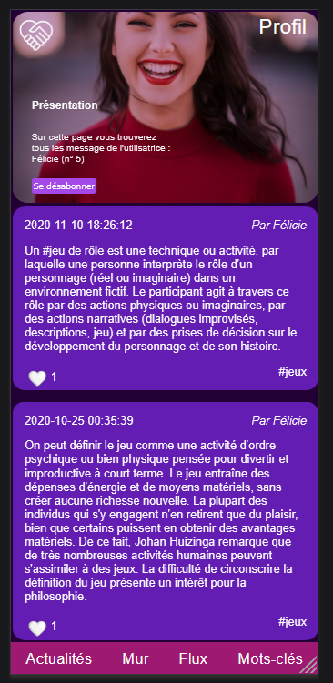

# Projet-Réseau-social

A partir d'une structure pré-existente (HTML, CSS, PHP et une base de donnée incomplète), nous avons développé un réseau social interactif utilisant les langages de programmation PHP et SQL.

Les différentes fonctionalités misent en place sont les suivantes : 
- Connexion / déconnexion
- Gestion des sessions
- Création de compte 
- Abonnement / désabonnement 
- Gestion des "likes"
- Gestion des "#tags"
- Création de messages 

        
   
